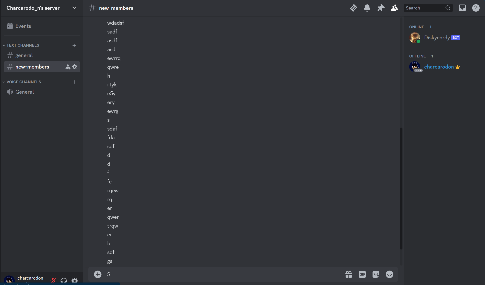
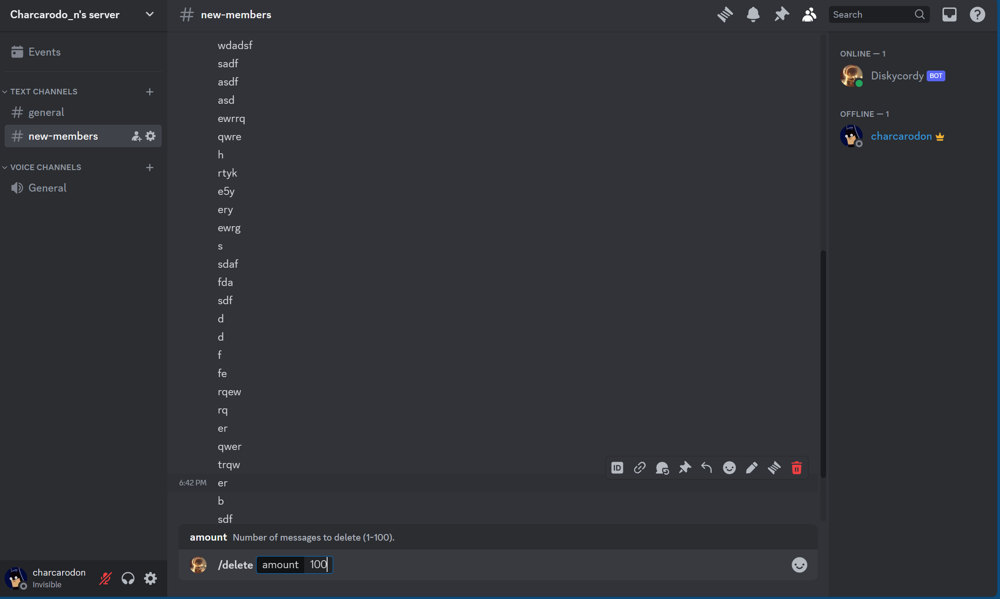
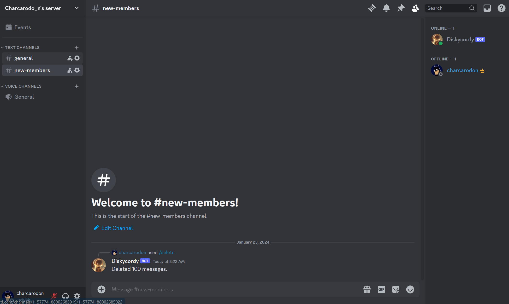
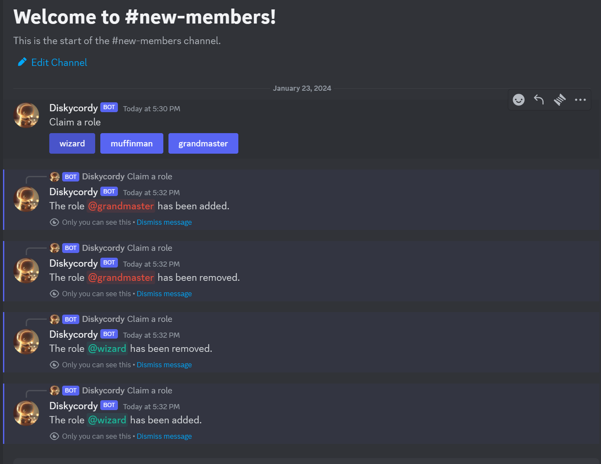

# Discordy 🤖

Welcome to very own personal assistant! Discordy is an interactive discord bot that is designed to provide additional functionalities ot your servers

## 🌟 Key Features:

- **Moderation Tools:** Keep your server safe and friendly with message deletion, ban, and timeout functionality.
- **Roles:** Custom member roles for each.
- **Levelling System:** Foster server loyalty and engagement by implementing a dynamic levelling system that rewards active participation and contribution, providing members with a sense of achievement and recognition.
- **Utility Commands:** Access helpful utilities for quick information retrieval such as getting each member's time in UTC for those late-night sessions with global friends.

## Feature Gallery: Main Features

### Message Deletion

  

### Role Assignment

## How to Use?

- clone repo
- install node.js
- discord.js
- install ms, pretty-ms in npm
- run with nodemon
